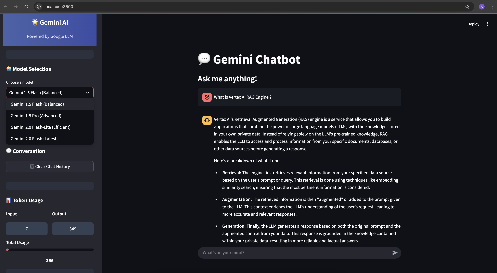
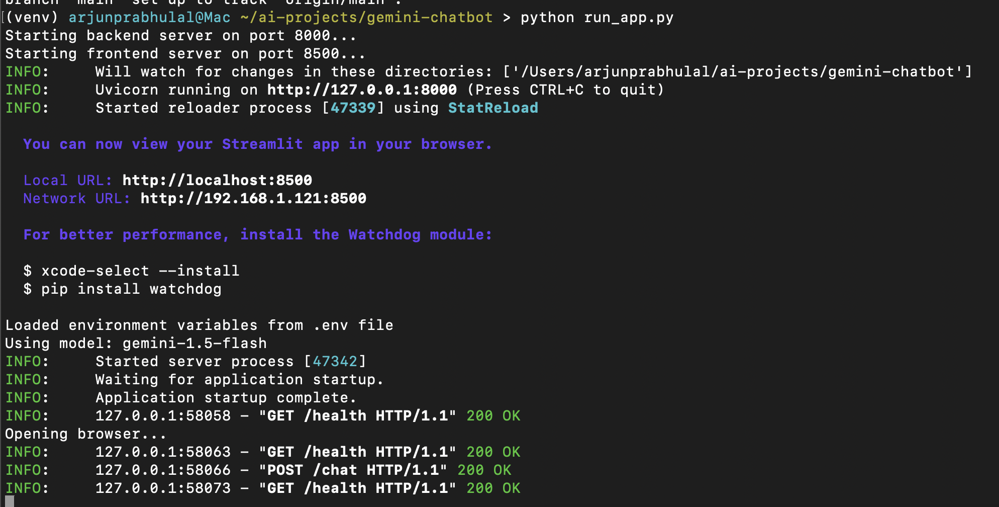

# Gemini Chatbot with FastAPI and Streamlit

A simple chatbot demo using Google's Gemini 1.5 Flash model with a FastAPI backend and Streamlit frontend.



## Features

- FastAPI backend with Gemini 1.5 Flash integration
- Streamlit frontend with a clean, modern chat interface
- Conversation history maintained during the session
- One-click conversation reset button
- Responsive design with custom styling
- Pydantic models for structured data validation
- Token usage tracking
- System health monitoring

## Logs Visualization

The application provides detailed logging information during runtime:



## Setup Instructions

### Prerequisites

- Python 3.8+
- Google API key for Gemini (get one from [Google AI Studio](https://makersuite.google.com/app/apikey))
- A Google Cloud project with the Gemini API enabled (may require billing setup)

### Installation

1. Clone this repository:
```bash
git clone https://github.com/arjunprabhulal/google-gemini-chatbot.git
cd google-gemini-chatbot
```

2. Create and activate a virtual environment:
```bash
# For macOS/Linux
python -m venv venv
source venv/bin/activate

# For Windows
python -m venv venv
venv\Scripts\activate
```

3. Install dependencies:
```bash
pip install -r requirements.txt
```

4. Set up your environment variables:

   Copy the example .env file and add your API key:
   ```bash
   cp .env.example .env
   # Edit the .env file with your Google Gemini API key
   ```

### Running the Application

Using the integrated run script (recommended):
```bash
python run_app.py
```

The application runs on:
- Backend (FastAPI): http://localhost:8000
- Frontend (Streamlit): http://localhost:8500

### Testing the Application

1. Open http://localhost:8500 in your browser
2. Type a message in the chat input
3. View token usage and system status in the sidebar

## Project Structure

- `backend.py`: FastAPI server with Gemini API integration
- `frontend.py`: Streamlit UI for the chat interface
- `run_app.py`: Script to start both services
- `requirements.txt`: Python dependencies

## API Documentation

### Chat Endpoint

```
POST /chat
```

Request body:
```json
{
  "messages": [
    {
      "role": "user",
      "content": "Hello, how are you?"
    }
  ]
}
```

Response:
```json
{
  "response": "I'm doing well, thank you for asking! How can I help you today?",
  "usage": {
    "prompt_tokens": 5,
    "completion_tokens": 14,
    "total_tokens": 19
  },
  "created_at": "2023-05-01T12:00:00.000Z"
}
```

### Health Check

```
GET /health
```

### List Models

```
GET /models
``` 